# Hermes Dashboard — LAN Exposure

> **Expose the Hermes Agent dashboard** (bound to `127.0.0.1:9119`) to other
> devices on your local network — **without** `--insecure` or modifying the
> dashboard's bind address.

[](linux/)
[](windows/)
[](LICENSE)
[](skills/)
[](https://github.com/totaldecay78/hermes-dashboard-lan-expose)

---

## 🎯 Hermes Agents — Quick Start

**Add this repo as a Hermes skill tap** for discoverable, installable LAN dashboard setup:

```bash
hermes skills tap add totaldecay78/hermes-dashboard-lan-expose
hermes skills install totaldecay78/hermes-dashboard-lan-expose/skills/hermes-dashboard-lan-expose
```

Then load it in any session: `/skill hermes-dashboard-lan-expose` or `hermes -s hermes-dashboard-lan-expose`.

### Auto-Detection Workflow

```mermaid
flowchart TD
    A[Clone repo] --> B{Detect OS}
    B -->|Linux| C[cd linux/ && sudo ./deploy.sh]
    B -->|Windows| D[cd windows/ && .\\deploy.ps1]
    C --> E[systemd user service]
    D --> E2[Scheduled Task]
    E --> F[Apply web_server.py patch]
    E2 --> F
    F --> G[Restart dashboard]
    G --> H[Verify]
```



> **Agent tip**: the `skills/hermes-dashboard-lan-expose/SKILL.md` file has
> the full workflow, troubleshooting, and security notes. After tapping the
> repo, load the skill for step-by-step instructions.

---

## 🔍 Keywords

If you're searching for:
- **Hermes dashboard LAN access** — this is it
- **Expose localhost to LAN** — nginx + iptables (Linux) / netsh (Windows)
- **Remote dashboard access** — reach `http://192.168.x.x:9191` from any device
- **Port forwarding for Hermes** — 9191 → 9119 via iptables DNAT or netsh portproxy
- **Hermes dashboard without --insecure** — safe LAN exposure without opening the dashboard to the WAN
- **Cross-platform network setup** — same patch for Linux and Windows
- **Systemd dashboard auto-start** — user service for dashboard LAN proxy
- **Scheduled Task dashboard** — Windows auto-start on boot

---

## 🧩 What Problem Does This Solve?

The Hermes dashboard listens on `127.0.0.1:9119` by design — only local
processes can reach it. Opening it to `0.0.0.0` via `--insecure` would let
any website read/modify config and secrets.

This package adds a **controlled LAN exposure layer**:

| Layer | Linux | Windows |
|-------|-------|---------|
| Port forwarding | `iptables DNAT` + nginx (port 9191→9119) | `netsh interface portproxy` |
| Host header adaptation | nginx rewrites → `127.0.0.1` | Patch accepts LAN IPs directly |
| Firewall | `firewalld` | `netsh advfirewall` |
| Auto-start | `systemd` user service | `schtasks` Scheduled Task |
| Web server | nginx (via dnf) | Built-in (no extra install) |

The Hermes `web_server.py` patch (`patches/allow-lan-origins.patch`) is the
**same file for both platforms** — Python source is cross-platform.

---

## 📦 Repository Structure

```
/
├── skills/                        ← Hermes skill (tap-ready)
│   └── hermes-dashboard-lan-expose/
│       └── SKILL.md               ← Full agent workflow + metadata
│
├── linux/                         ← Fedora/RHEL (dnf, nginx, iptables, firewalld)
│   ├── deploy.sh                  ← One-shot infrastructure deploy (run as root)
│   ├── verify.sh                  ← Post-deploy verification
│   ├── rollback.sh                ← Clean removal
│   ├── deploy-dashboard-user-service.sh  ← systemd user service auto-start
│   ├── config/                    ← Templated nginx, sysctl, systemd service files
│   ├── patches/                   ← Git patch for Hermes web_server.py
│   └── README.md                  ← Linux-specific instructions
│
├── windows/                       ← Windows 8.1+ (PowerShell 5.1, netsh, schtasks)
│   ├── deploy.ps1                 ← One-shot infrastructure deploy (run as Admin)
│   ├── verify.ps1                 ← Post-deploy verification
│   ├── rollback.ps1               ← Clean removal
│   ├── deploy-dashboard-startup.ps1  ← Scheduled Task auto-start
│   ├── patches/                   ← Same git patch (cross-platform Python source)
│   └── README.md                  ← Windows-specific instructions
│
└── patches/                       ← Cross-platform web_server.py patch
```

---

## 🔧 Quick Reference

| Task | Linux | Windows |
|------|-------|---------|
| Deploy everything | `sudo ./linux/deploy.sh` | `.\windows\deploy.ps1` (Admin) |
| Verify | `./linux/verify.sh` | `.\windows\verify.ps1` (Admin) |
| Rollback | `sudo ./linux/rollback.sh` | `.\windows\rollback.ps1` (Admin) |
| Dashboard auto-start | `./linux/deploy-dashboard-user-service.sh` | `.\windows\deploy-dashboard-startup.ps1` (Admin) |
| Patch web_server.py | `cd ~/.hermes/hermes-agent && git apply linux/patches/allow-lan-origins.patch` | `cd $env:USERPROFILE\.hermes\hermes-agent && git apply windows\patches\allow-lan-origins.patch` |

---

## 🔐 Security Notes

- **No `--insecure`**: The dashboard stays on `127.0.0.1`. Only the specific
  operations described above allow LAN access.
- **RFC1918 only**: The CORS and Host validation patches only accept private
  IP ranges (`10.x.x.x`, `172.16-31.x.x`, `192.168.x.x`). Public/WAN requests
  are still rejected.
- **Local proxy**: On Linux, nginx runs on the same machine and rewrites the
  Host header — LAN browsers never talk directly to the dashboard process.
- **Windows native**: On Windows, netsh portproxy is a kernel-level TCP tunnel
  — no userspace proxy process.
- **Rollback scripts**: Every deploy action has a corresponding rollback.

---

## 🌐 Access from LAN

Once deployed, open `http://<YOUR_LAN_IP>:9191` from any device on your network.

- **Linux**: `ip addr show` to find your LAN IP
- **Windows**: `ipconfig` to find your LAN IP

---

## 📝 License

MIT — use freely, modify, share. Contributions welcome!
